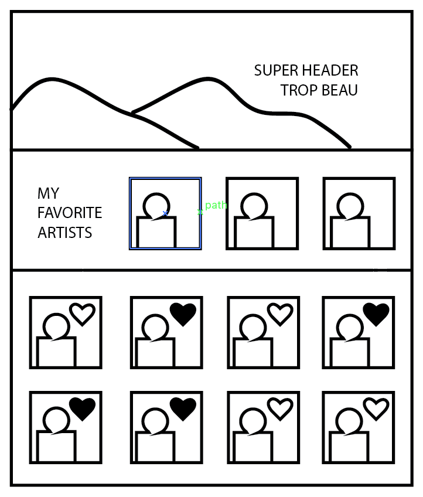

Angular 4 Like Challenge!
===================

Apprendre a utiliser des services/injectables. Solidifier les connaissances en architecture / input / output.

----------

Layout
-------------

Instructions
-------------

- Je récupère un tableau d'artistes/pokemons/soundtracks/...
- Quand je clique sur le bouton/icon like celle-ci se colore et ajoute l'élément à un tableau favorites.
- Les 3 premiers éléments de ce tableau s'affiche dans l'entête de ma page
- BONUS : Stocker le tableau dans mon localstorage.

> Important

> - Découper en mini-micro-tâches par priorité de facilité.
> - Toujours commencer avec de la fake data avant d'utiliser de la vraie data.
> - Essayer de mettre en pratique le maximum d'éléments vus.

Des APIs Cools
-------------

- [Marvel](https://developer.marvel.com/)
- [LastFM](https://www.last.fm/)
- [Star Wars](https://swapi.co/)
- [Gaming](https://developer.riotgames.com/)
- [Bières](http://www.brewerydb.com/browse)
- [Pokemon](https://pokeapi.co/)
- [Harry Potter](https://hp-api.herokuapp.com/)
